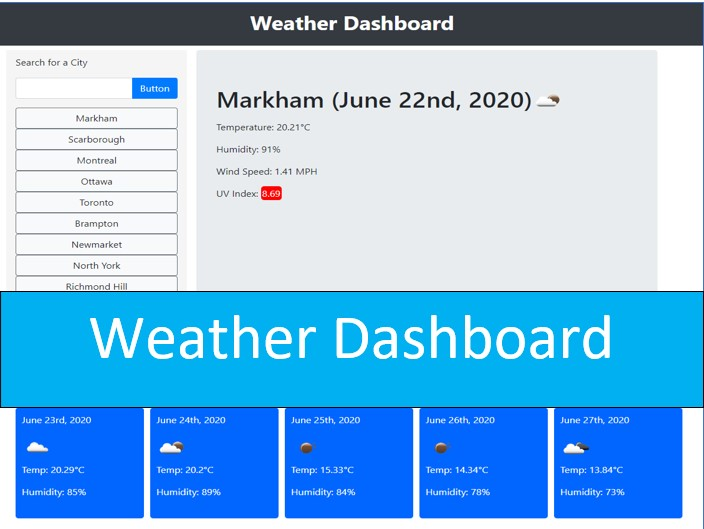

# 6-Weather-Dashboard

This is a practice Weather Dashboard function for Bootcamp Student.

# Instruction 

This a simple Weather application that allows users to see the current and 5 day forecast weather. Users can only search any city in Canada. 

The current weather will display City, Date, Temperature, Humidity, Wind Speed, and UV index.  Next to the date, an icon will show a picture of the current weather. 

The 5 day forecast will display 5 days starting tomorrow date, Temp, and Humidity.  Next to the date, an icon will show a picture of the near the same time the weather will appear. 

After each search there is a history list below the search bar.  Users can click on each city to see the current and 5 day forecast weather.  

# About this application

This application uses API from openweather.  It can search by city name or in the history list.  The search ignores all caps and spaces between easy for everyone.  If users enter an invalid name.  An alert will appear until a correct name is entered.   If the users click on the history, that city will go to the top of the list.  If the users enter a new search the last city on the list will be gone. 

# The URL of the deployed application

https://wilsonruan.github.io/6-Weather-Dashboard/

# The URL of the GitHub repository

https://github.com/Wilsonruan/6-Weather-Dashboard